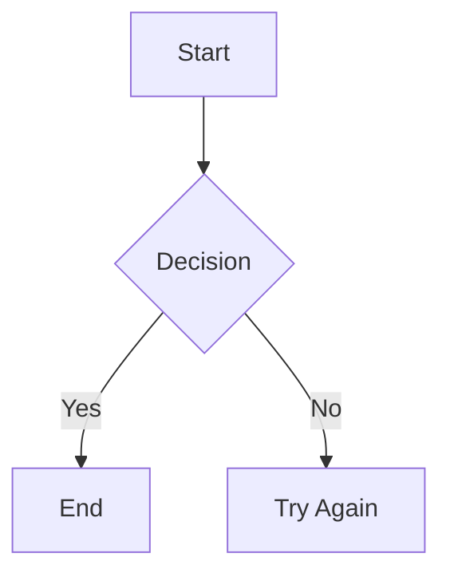

# Mermaid + Markdown Document Editor

A dual-purpose document editor for creating, editing, and sharing both **Mermaid diagrams** and **Markdown documents** with live preview and URL-based sharing.

## Features

### Mermaid Diagrams
- Create and edit Mermaid diagrams in real-time
- Live preview with instant rendering
- Split-pane editor interface
- Fullscreen view for presentations
- Compress diagrams into shareable URLs
- Save history in localStorage (30 items max)

### Markdown Documents  
- Write markdown with live HTML preview
- Document titles for better organization
- Professional markdown styling
- Support for headings, lists, tables, code, and more
- Same sharing and history features as diagrams

### Shared Features
- **Document Center**: Unified dashboard for all documents
- **Live Preview**: Real-time rendering as you type
- **URL Sharing**: Compress content into URLs for easy sharing
- **Save/Load**: Persistent storage in browser localStorage
- **Clipboard Support**: Paste content directly from clipboard
- **Responsive Design**: Works on desktop and mobile

## Project Structure

```
src/
├── components/
│   ├── Home.jsx                 # Document Center dashboard
│   ├── Workspace.jsx            # Mermaid editor & fullscreen
│   └── MarkdownWorkspace.jsx    # Markdown editor & fullscreen
├── hooks/
│   ├── useDiagramHistory.js     # Diagram history management
│   └── useMarkdownHistory.js    # Markdown history management
├── utils/
│   ├── compression.js           # LZ-String compression/decompression
│   ├── mermaid.js               # Mermaid initialization & rendering
│   └── markdown.js              # Markdown parsing with marked
├── constants/
│   └── config.js                # App configuration & defaults
├── styles/
│   ├── global.css               # Shared styles & responsive layout
│   └── markdown.css             # Markdown preview styling
└── App.jsx                      # Router configuration
```

## Routes

- `/` - Document Center (home/dashboard)
- `/edit/:encodedData?` - Mermaid editor
- `/view/:encodedData` - Mermaid fullscreen
- `/markdown/edit/:encodedData?` - Markdown editor
- `/markdown/view/:encodedData` - Markdown fullscreen

## Technologies

- **React 19** - UI framework
- **Vite** - Build tool
- **React Router** - Client-side routing
- **Mermaid 11** - Diagram rendering
- **Marked** - Markdown parsing
- **Monaco Editor** - Advanced code editor
- **LZ-String** - URL compression

## Getting Started

### Install Dependencies
```bash
npm install --legacy-peer-deps
```

### Development
```bash
npm run dev
```

### Build
```bash
npm run build
```

### Preview Build
```bash
npm run preview
```

## Usage

### Creating a New Document
1. Go to the Document Center (`/`)
2. Click **"+ New Diagram"** for Mermaid or **"+ New Markdown"** for markdown
3. Edit in the split-pane view with live preview
4. Click **Save** to preserve to history

### Sharing
- The URL is automatically updated when you save
- Share the full URL with anyone to let them view your document
- Anyone can edit and create new versions from a shared link

### Markdown Syntax

Common markdown examples:
```markdown
# Heading 1
## Heading 2

**Bold text** and *italic text*

- Bullet list
- Item 2

1. Numbered list
2. Item 2

[Link](https://example.com)

`inline code`

\`\`\`
code block
\`\`\`

| Header 1 | Header 2 |
|----------|----------|
| Cell 1   | Cell 2   |
```

### Mermaid Syntax

Example diagrams:


See [Mermaid documentation](https://mermaid.js.org/) for syntax details.

## Browser Storage

- Documents are stored in localStorage
- Maximum 30 items per document type
- No server required - fully client-side
- Data persists across browser sessions

## Tips

- Use **Fullscreen** mode to focus on your document
- **Paste** from clipboard to quickly insert content
- **Clear** to start fresh (with confirmation)
- Open browser DevTools → Application → LocalStorage to inspect saved documents
- Share URLs are automatically shortened through compression

## License

MIT
